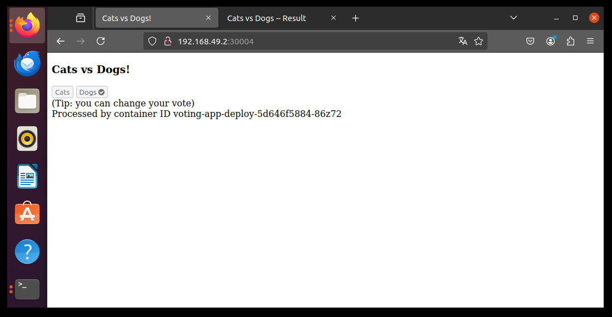
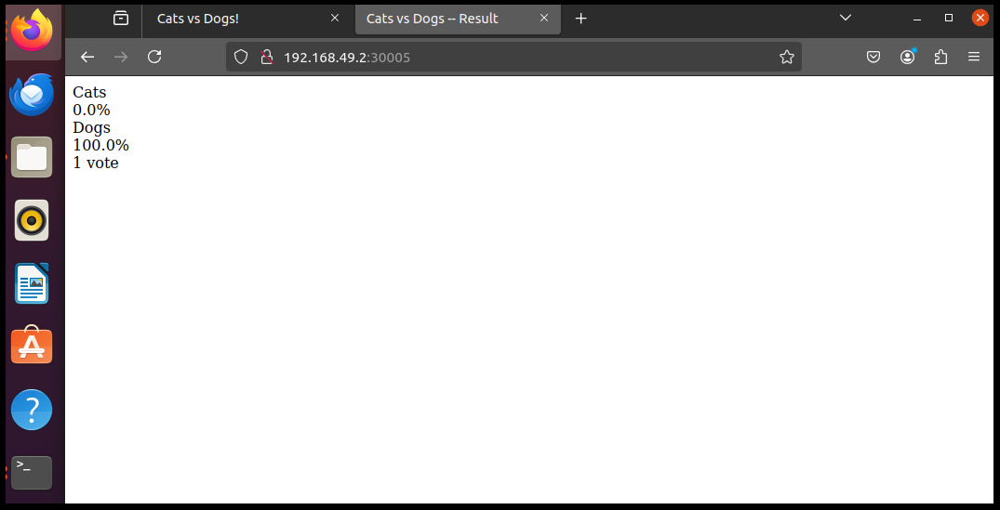

# Proyecto de Práctica de Kubernetes

¡Hola! Este repositorio es un proyecto simple que he creado para practicar Kubernetes.

## Tecnologías Utilizadas

- *Kubernetes*: La plataforma principal para la orquestación de contenedores.
- *Docker*: Para la creación y gestión de contenedores.
- *kubectl*: La herramienta de línea de comandos para interactuar con el clúster de Kubernetes.

## Resultados

